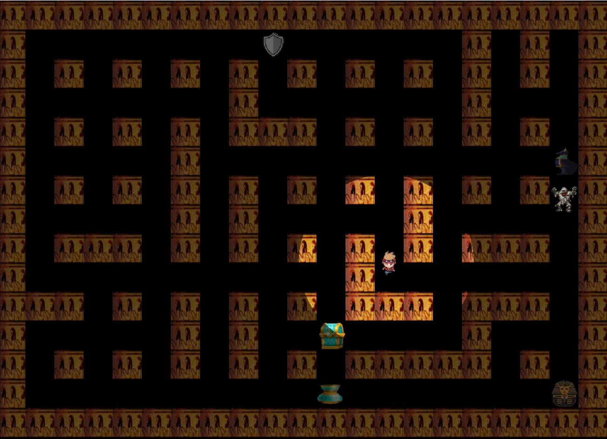
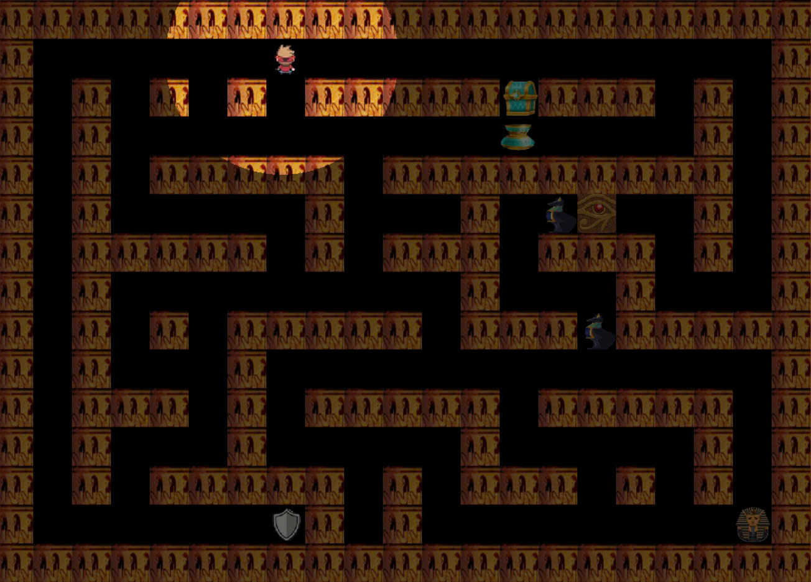
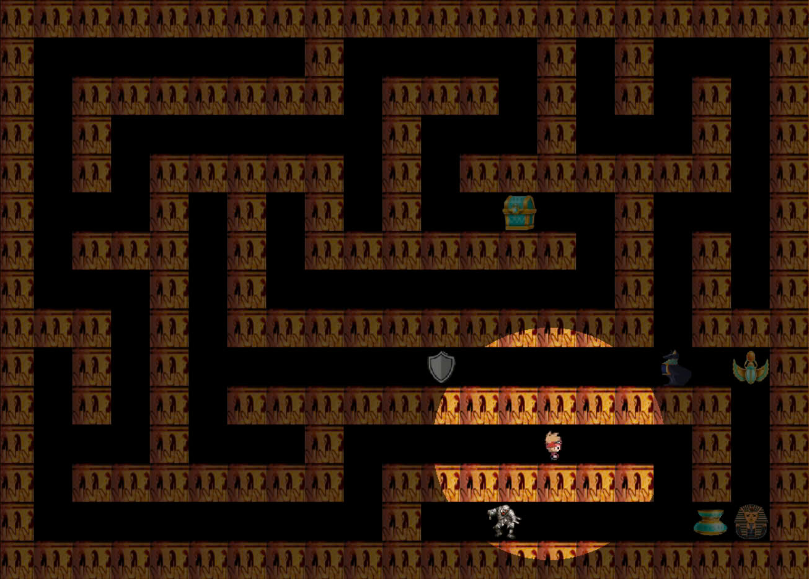
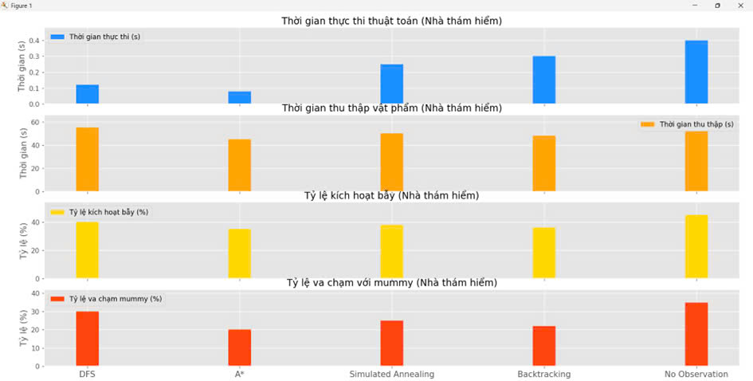
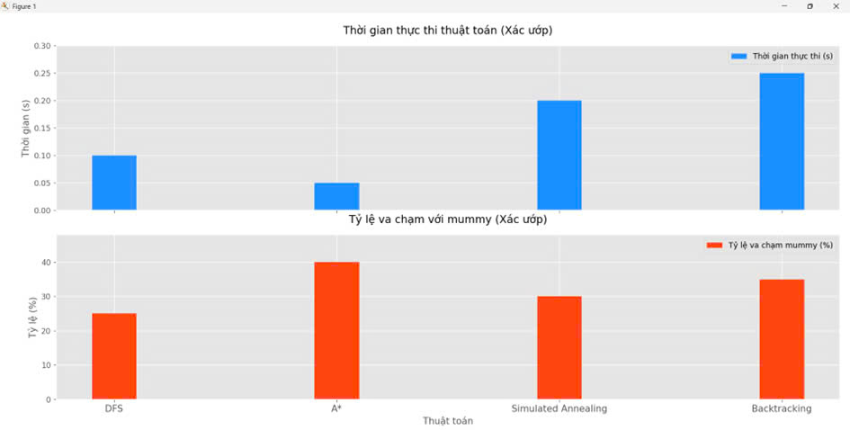

# Do_an_AI
# 🗺️ Ancient Egypt Maze Adventure

## Giới thiệu
Ancient Egypt Maze Adventure là một trò chơi 2D dựa trên lưới, được xây dựng bằng Pygame, lấy bối cảnh Ai Cập cổ đại với các yếu tố như kim tự tháp, xác ướp, và kho báu. Người chơi hoặc AI điều khiển nhà thám hiểm (human) để thu thập 5 vật phẩm, tránh bẫy, né xác ướp, và đến đích an toàn. Xác ướp được kích hoạt khi bẫy được chạm vào và sử dụng các thuật toán AI để truy đuổi nhà thám hiểm. Trò chơi hỗ trợ nhiều thuật toán tìm đường và các mê cung với độ khó khác nhau.


## 🔧 Tính năng
- **Gameplay năng động**: Nhà thám hiểm thu thập vật phẩm, tránh bẫy, và né xác ướp; xác ướp chuyển từ trạng thái ngủ sang truy đuổi khi bẫy được kích hoạt.
- **Thuật toán AI**: Hỗ trợ DFS, A*, Simulated Annealing, Backtracking, Searching with No Observation (BFS-NoObs), và Q-Learning.
- **Bản đồ tùy chỉnh**:Tạo ngẫu nhiên hoặc tải từ file, với các mức độ khó (Dễ, Trung bình, Khó) và kích thước cố định (21x15 theo cấu hình mặc định).
  - 
  - 
  - 
- **Bẫy và khiên**: Bẫy kích hoạt xác ướp; khiên bảo vệ nhà thám hiểm khỏi xác ướp trong thời gian ngắn ( xác ướp bị đóng băng ).
- **Chế độ chơi**: Tên trộm có thanh máu; người chủ có thanh thể lực ảnh hưởng khả năng đuổi bắt.
        - 
        - **Player vs AI**: Người chơi điều khiển nhà thám hiểm, xác ướp do AI điều khiển.
        - **AI vs AI**: Cả nhà thám hiểm và xác ướp do AI điều khiển.
- **Âm thanh**: Nhạc nền Ai Cập cổ đại và hiệu ứng âm thanh khi thu thập vật phẩm, kích hoạt bẫy, hoặc game over.
- **Menu**: Chọn chế độ chơi, thuật toán cho nhà thám hiểm và xác ướp, mức độ khó, bản đồ, bật/tắt âm thanh.
        - 
- **Lưu trạng thái**: Hỗ trợ lưu và tiếp tục trò chơi từ trạng thái đã lưu.
- **Thống kê**: Ghi lại thời gian, số vật phẩm thu thập, và kết quả (thắng/thua)


## ⚙️ Cài đặt
1. **Clone Repository**:
   ```bash
   git clone https://github.com/thauu-01/Do_an_AI.git
   cd Do_an_AI
   ```
2. **Cài đặt thư viện**:
   Cài Python 3.8+ và các thư viện:
   ```bash
   pip install pygame pytmx numpy
   ```

## 🎮 Cách chơi
1. **Khởi động**:
   ```bash
   python main.py
   ```
2. **Menu chính**:
   - Chọn chế độ chơi (Player vs AI hoặc AI vs AI).
   - Chọn thuật toán AI cho nhà thám hiểm và xác ướp (DFS, A*, Simulated Annealing, Backtracking, BFS-NoObs, Q-Learning).
   - Chọn mức độ khó (Dễ, Trung bình, Khó) và bản đồ
   - Nhấn Start Game hoặc Continue Game (nếu có trạng thái lưu)
3. **Gameplay**:
   - Nhà thám hiểm di chuyển để thu thập 5 vật phẩm, nhặt khiên (nếu có), tránh bẫy, và đến đích.
   - Bẫy kích hoạt xác ướp, khiến xác ướp truy đuổi nhà thám hiểm.
   - Nhấn **ESC** quay lại menu hoặc thoát game.
4. **Kết thúc**:
   - Thành công: Thu thập đủ 5 vật phẩm và đến đích.
   - 
   - Thất bại: Bị xác ướp bắt.
## Demo trò chơi
| Thuật toán | GIF |
|------------|-----|
| **BFS** |  |
| **ASTAR** |  |
| **PartialObservation** |  |
| **BeamSearch** |  |
| **Q-Learning** |  |

## 📈 Hiệu suất thuật toán

  - 
  - 

- **DFS**: 
```bash
    Ưu điểm: Nhanh trong các mê cung nhỏ, đơn giản triển khai.
    Nhược điểm: Đường đi dài , tỷ lệ va chạm xác ướp cao (30%), dễ kích hoạt bẫy (40%).
    Phù hợp: Mê cung đơn giản, không yêu cầu đường đi tối ưu.
   ```
- **A***: 
```bash
    Ưu điểm: Nhanh nhất (0.08s cho nhà thám hiểm, 0.05s cho xác ướp), đường đi ngắn (trung bình 45 bước), tỷ lệ va chạm thấp (20% cho nhà thám hiểm, 40% cho xác ướp).
    Nhược điểm: Phụ thuộc vào heuristic Manhattan, kém hiệu quả nếu heuristic không tối ưu.
    Phù hợp: Mê cung có cấu trúc rõ ràng, cần đường đi tối ưu.
   ```
- **Simulated Annealing**: 
```bash
    Ưu điểm: Linh hoạt trong mê cung phức tạp, đường đi gần tối ưu (trung bình 50 bước).
    Nhược điểm: Chậm hơn A* (0.25s), phụ thuộc vào tham số nhiệt độ, tỷ lệ va chạm cao (25%).
    Phù hợp: Môi trường cần khám phá đa dạng hoặc không yêu cầu tối ưu tuyệt đối.
   ```
- **Backtracking**: 
```bash
    Ưu điểm: Hiệu quả với ràng buộc phức tạp (đi qua tất cả vật phẩm, khiên, bẫy), đường đi ngắn (trung bình 48 bước).
    Nhược điểm: Chậm (0.30s), có thể chậm trong mê cung nhiều ngõ cụt.
    Phù hợp: Mê cung có nhiều ràng buộc hoặc cần đảm bảo đi qua tất cả mục tiêu.
   ```
- **Searching with No Observation (BFS-NoObs)**: 
```bash
    Ưu điểm: Phù hợp cho môi trường thiếu thông tin, điều khiển nhiều nhân vật.
    Nhược điểm: Chậm nhất (0.40s), đường đi dài (trung bình 52 bước), tỷ lệ va chạm (35%) và kích hoạt bẫy cao (45%).
    Phù hợp: Kịch bản đặc biệt với thông tin hạn chế.
   ```
- **Q-Learning**: Linh hoạt, thích nghi tốt với môi trường phức tạp, nhưng tốn tài nguyên và không ổn định về đường đi.
```bash
    Ưu điểm: Học từ trải nghiệm, thích nghi với môi trường động.
    Nhược điểm: Cần nhiều thời gian huấn luyện, không gian trạng thái lớn, đường đi không ổn định.
    Phù hợp: Môi trường phức tạp, cần học hành vi dài hạn.
   ```

## 📝 Tác giả
**Nhóm 17**
- Trần Thành Trung - 23110351
- Nguyễn Trung Hậu - 23110212
- Đoàn Quân Tuấn - 23110354
